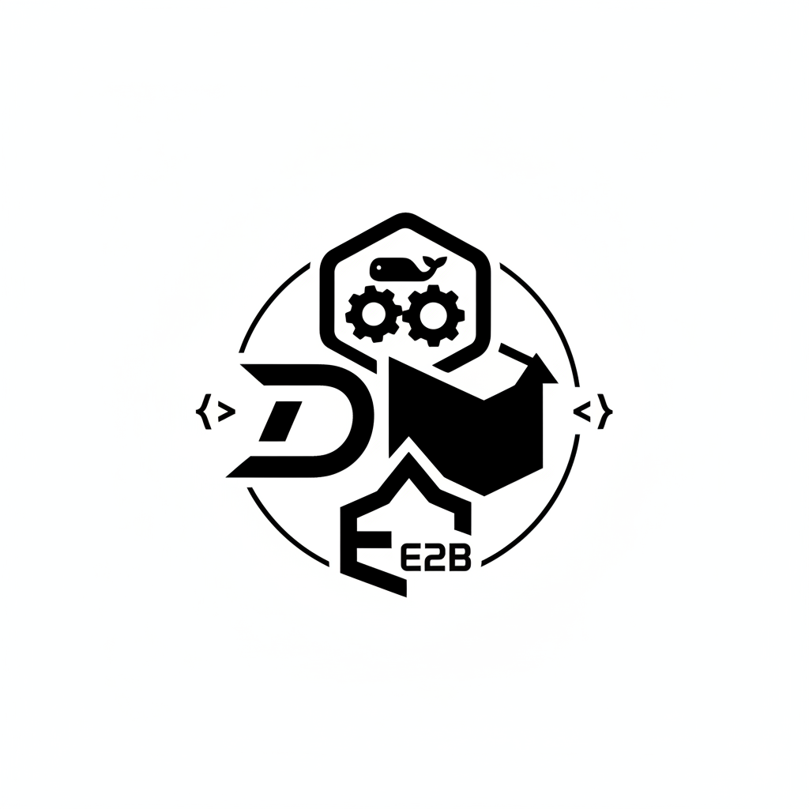
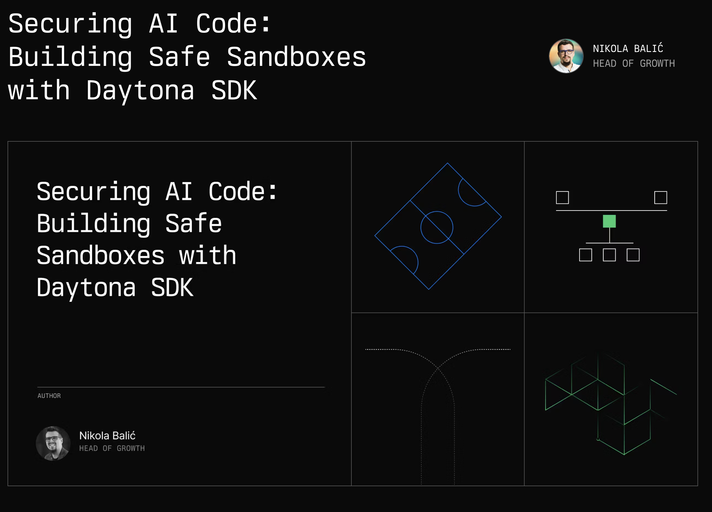

  

### PolySandbox

One Interface to Run AI Code Across Daytona, E2B, and Docker
PolySandbox is a unified sandbox orchestrator that lets you safely run, evaluate, and compare Python code across multiple execution backends — all through one consistent interface.
It’s designed for benchmarking AI-generated code from datasets like MBPP and HumanEval, enabling reproducible and backend-agnostic evaluation.

  

### Features

Unified API — One /run endpoint for Daytona, E2B, and Docker

Dataset Integration — Load MBPP and HumanEval tasks for evaluation

FastAPI Backend — Clean async API for sandbox orchestration

Streamlit UI — Simple interface to run and compare results visually

Scoring & Metrics — View stdout, stderr, runtime, and correctness

Extensible Design — Add new sandboxes or datasets easily via adapters

### Architecture
User/UI  →  FastAPI Server  →  Evaluator  →  Sandbox Adapter  →  Daytona/E2B/Docker

  

Adapters: Implement a shared SandboxClient interface
Evaluator: Normalizes results into an ExecutionResult schema
RunnerAgent: Chooses backend and coordinates runs dynamically

### Setup
1️⃣ Install UV and dependencies
uv venv
source .venv/bin/activate
uv sync

2️⃣ Set up environment variables

Create a .env file (not committed):

DAYTONA_API_KEY=your_key_here
E2B_API_KEY=your_key_here

3️⃣ Run the API
uv run uvicorn poly_sandbox.main:app --reload

4️⃣ Run the Streamlit UI
uv run streamlit run poly_sandbox/ui/app.py

### Testing

Run all tests:

uv run pytest -v

Run a specific test:

uv run pytest poly_sandbox/tests/test_adapters.py

🧩 Example API Call
curl -X POST "http://localhost:8000/run" \
  -H "Content-Type: application/json" \
  -d '{"backend":"daytona","code":"print(2+3)","tests":"assert 2+3==5"}'

Response:

{
  "stdout": "5",
  "stderr": "",
  "success": true,
  "runtime_ms": 423,
  "backend": "daytona"
}

### Folder Structure
poly_sandbox/
├── adapters/        # Daytona, E2B, Docker clients
├── datasets/        # MBPP, HumanEval loaders
├── evaluators/      # Executor + Scorer logic
├── ui/              # Streamlit frontend
├── utils/           # Config, logging
├── tests/           # Pytest suite
└── main.py          # FastAPI entrypoint

### Inspiration

Evaluating AI code safely across sandboxes is fragmented.
PolySandbox unifies it — one API, multiple backends, consistent results.

### Hackathon Highlights

Unified interface for three sandbox systems

End-to-end demo (UI → API → Sandbox → Scorer)

Modular and extensible adapter architecture

Built in under 10 hours for a hackathon demo

  

